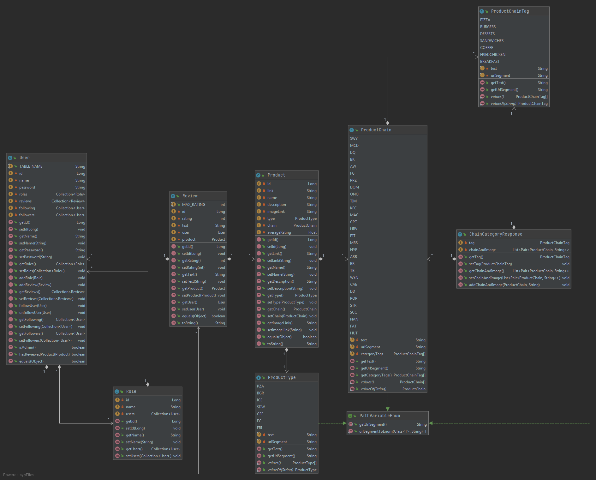

# 4806-project

## Heroku:

https://sysc4806app.herokuapp.com/

## Travis:

https://travis-ci.com/github/samjjc/4806-project

## Branch Naming Convention

name/branch-name-like-this

name can be first initial, last name like bmelone or part of each name like samcat

## Commit Naming Convention

Try to start with a verb in past tense. Short name in the first line then a blank line and you can write a longer description below it.

Example:

Added the new feature

This feature will allow users to add new products to the app.

## Current State of Project

With respect to the kanban, all milestone one and two issues have been completed:

### Milestone 1:

- app is configured to use travis CI, heroku, postgres
- model objects are completed and stored in database
- functionality for products is complete

### Milestone 2:

- added user page, following, followers, user linked to review
- improved login, added sign up
- added chain page, filtering, product images

## Plan for Next Milestone

Important features for the third milestone:
- Jaccard distance
- degress of separation
- homepage
- add error pages

## Database Schema

## UML Class Diagram

